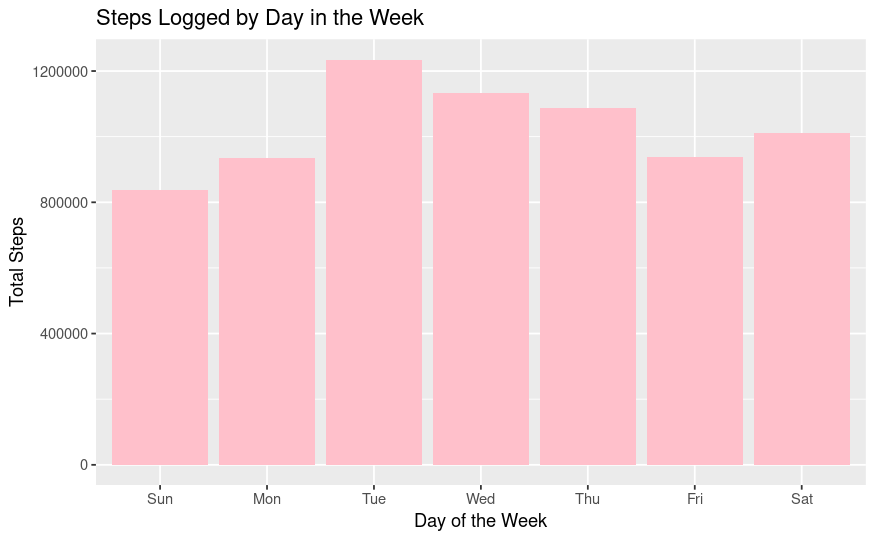
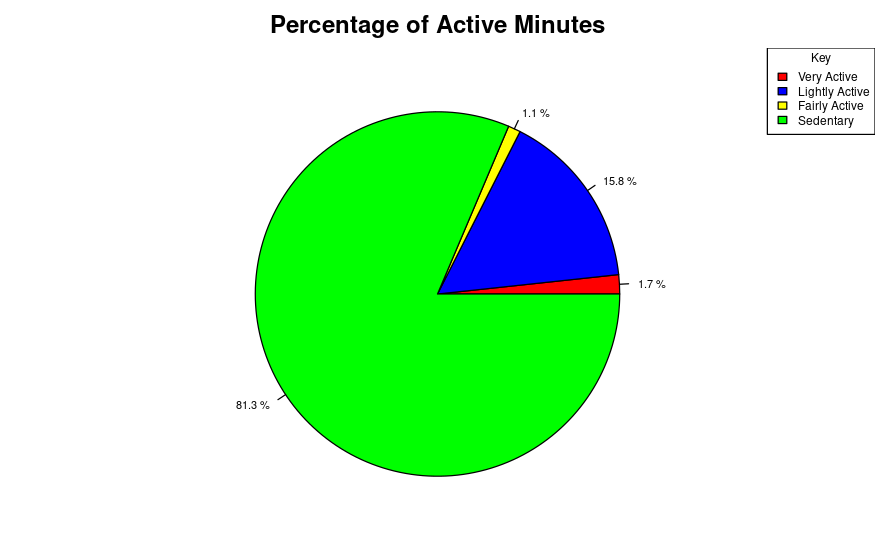
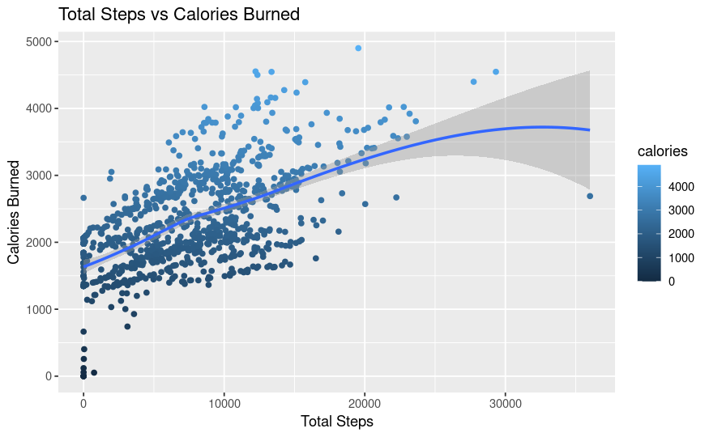

# bellabeat-google-dap
Google Data Analytics Capstone Project

# Bellabeat Case Study
## A Google Data Analytics Case Study on how can a wellness company play it smart.

## Introduction

Bellabeat is a technology company specializing in innovative wellness and fitness solutions, with a particular focus on women's health and well-being. They offer a range of smart wearable devices and associated mobile applications designed to empower individuals to monitor and improve their health and fitness. Bellabeat's products provide users with the tools to track various aspects of their well-being, including physical activity, sleep, stress levels, and reproductive health. The company is committed to promoting a holistic approach to health and wellness, offering features and insights that help users make informed decisions about their lifestyles and daily routines. Bellabeat's products aim to seamlessly integrate technology into daily life while prioritizing user health and comfort.

I will assume the role of a junior data analyst. You will imagine you are working for Bellabeat, a high-tech manufacturer of health-focused products for women, and meet different characters and team members. In order to answer the key business questions, I will follow the steps of the data analysis process: ask, prepare, process, analyze, share, and act.

Click [Bellabeat](https://bellabeat.com/) for more information.

## ASK

In this phase, we need to identify who the key stakeholders are. In this case, we have the following stakeholders: 

- **Urška Sršen:** Co-founder of Bellabeat - Chief Creative Officer - initiated the project.
-  **Sando Mur:** Cofounder of Bellabeat - Mathematician - Member of Bellabeat executive team
-  **Bellabeat marketing analytics team:** Bellabeat's analyst team - Helping to guide the company's marketing strategy

### Guiding Questions
* What are some trends in smart device usage?
*  How could these trends apply to Bellabeat customers?
*   How could these trends help influence Bellabeat marketing strategy?

## Prepare
Sršen encourages you to use public data that explores smart device users’ daily habits. She points you to a specific data set:
[FitBit Fitness Tracker Data](https://www.kaggle.com/arashnic/fitbit) (CC0: Public Domain, dataset made available through Mobius): This Kaggle data set
contains personal fitness tracker from thirty fitbit users. Thirty eligible Fitbit users consented to the submission of
personal tracker data, including minute-level output for physical activity, heart rate, and sleep monitoring. It includes
information about daily activity, steps, and heart rate that can be used to explore users’ habits.
Sršen tells you that this data set might have some limitations, and encourages you to consider adding another data to help
address those limitations as you begin to work more with this data.

The data is contained in 18 CSV files via Amazon Mechanical Turk between April 12, 2016 - May 12, 2016.

I removed duplicates and also made sure certain data types were consistent across all formats

#### Business Task:

Analyze fitness data from Fitbit users to uncover consumer usage insights and apply high-level marketing recommendations to one of Bellabeat's products to drive growth and enhance digital marketing strategies for the company. 

#### Data Integrity 

After viewing the data, I discovered there are some limitations: 

- The data only used 33 individuals which makes the sample size small which makes the data prone to bias
- The data is currently 9 years old and would no longer be considered relevant to the current representation of women today.

## Analyze
Based on Bella Beat’s request, we are going to examine the daily activities, weight, and sleep of the users to see if we can find any trends and correlations. We will then use all of the data collected and analyzed to determine proper marketing strategy suggestions that could help improve the company's marketing

* Data from weight table and daily_activity table were merged into one table
* A weekday column was added to determine the correlation between the day of the week and various columns.
* Various columns were summarized to uncover trends in order to create visualizations

# Share

## Graph 1

- We see that Tuesday, Wednesday, and Thursday have the most steps, and **Sunday** has the least number of steps. We can assume this behavior is due to users becoming busier with work and/or personal lives during this time and may be too exhausted and least likely to exercise or meet their steps by **Friday-Monday**. 
- We show that the steps feature is commonly used among users which marketing can reference and apply to their mobile fitness devices as well.

## Graph 2

*The pie chart shows that users are spending the majority of their time inactive which covers 81.3% of the chart.
*This information can be used by marketing to include a feature that  encourages users to reduce their sedentary minutes and become more active throughout the day with alerts or reminders to encourage movement. 
*This can create fitness targets that users will want to achieve.

## Graph 3

* We show a positive correlation between total steps and the calories burned. This indicates the more steps taken, the more calories burned which is important information for Bellabeat to know.

  

